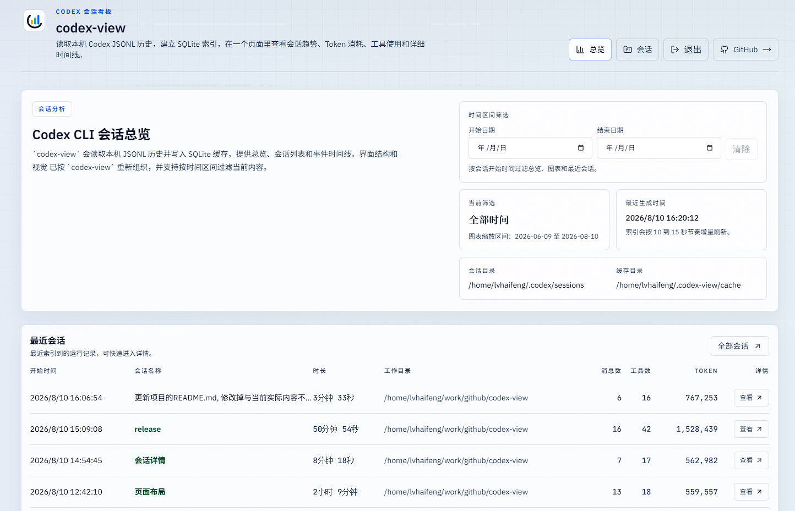
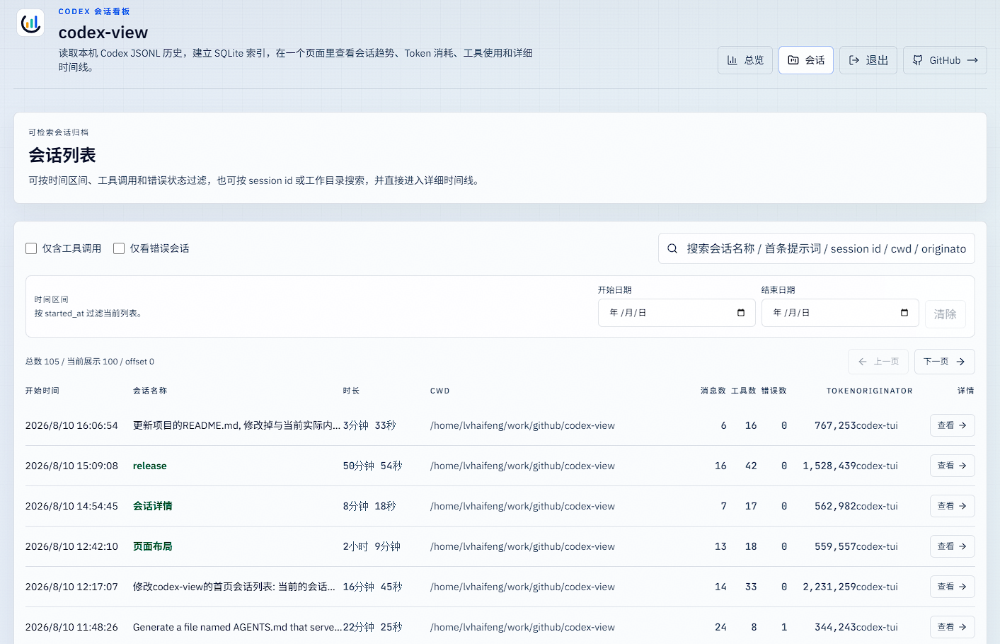
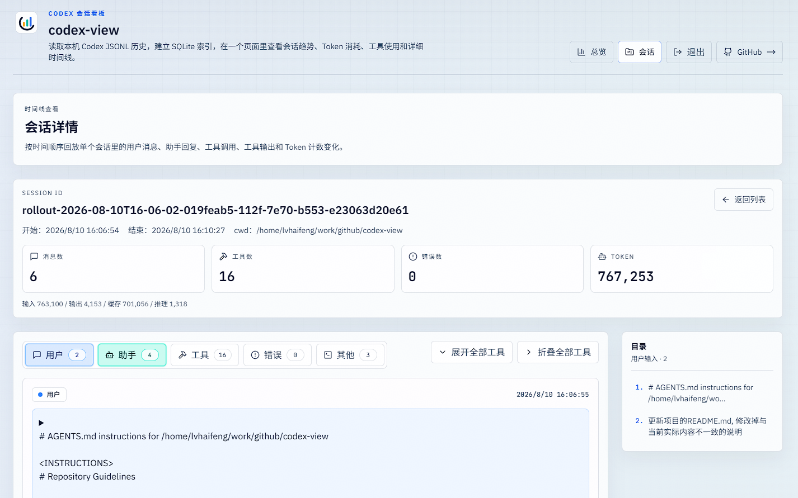

# codex-view

本地 Codex CLI 会话历史可视化面板。 fork from: `github.com/vicksiyi/codex-view`

`codex-view` 会递归读取 Codex 会话目录中的 JSONL 文件，增量建立 SQLite 索引，并提供会话统计、检索和时间线查看界面。所有会话内容和缓存都保留在本机。

## 功能

- 总览：统计会话、消息、工具调用、错误和 Token 用量，并按日展示趋势
- 时间筛选：按会话开始日期过滤总览、趋势图、工具排行、工作目录和会话列表
- 会话检索：按自定义会话名称、首条用户提示、`session id`、`cwd` 或 `originator` 搜索，并可只查看包含工具调用或错误的会话
- 会话时间线：查看用户消息、助手消息、工具调用及输出、错误和 Token 计数
- 时间线浏览：按事件类型显示或隐藏内容，将工具调用与对应输出分组、批量折叠或展开，并通过用户输入目录快速跳转
- 自动更新：运行期间定期增量扫描新增或有变更的会话文件

## Fork修改

- 会话列表显示会话名字;
- 详细会话页面显示用户输入提示词的目录;
- 详细会话默认不开启"工具"和"错误";
- 页面增加"退出"按钮;

## 页面截图

以下截图基于本机 `~/.codex/sessions` 的真实数据生成。

### 总览页



### 会话列表页



### 会话详情页



## 环境要求

- Node.js `>= 20.9.0`
- pnpm（从源码运行时需要）

项目使用 `better-sqlite3`，不依赖仅在较新 Node.js 版本中提供的 `node:sqlite`。

## 本地开发

```bash
pnpm install
pnpm dev
```

Next.js 默认在 `http://localhost:3000` 启动开发服务器；如果端口已被占用，会选择其他可用端口。

提交改动前可运行：

```bash
pnpm lint
pnpm build
```

## 数据目录和缓存

默认会话目录为 `~/.codex/sessions`，默认缓存目录为 `~/.codex-view/cache`。可以通过环境变量覆盖：

```bash
CODEX_SESSIONS_DIR=/path/to/sessions \
CODEX_VIEW_CACHE_DIR=/path/to/cache \
pnpm dev
```

自定义会话名称从会话目录同级的 `session_index.jsonl` 读取。缓存目录中包含 SQLite 索引和时间线缓存；需要重新索引时可以在服务停止后删除该缓存目录。

会话历史可能包含提示词、工作目录和工具输出等敏感内容，请勿提交或公开缓存及原始 JSONL 文件。

## 全局安装

```bash
npm install -g codex-view
codex-view
```

CLI 默认绑定 `127.0.0.1`，从 `3000` 开始在连续 50 个端口中选择可用端口，服务就绪后自动打开浏览器。可以在页面顶部点击“退出”，或在终端按 `Ctrl+C` 停止服务。

可用命令和参数：

```text
codex-view [options]
codex-view start [options]

--port <number>        首选端口，默认 3000
--host <host>          绑定地址，默认 127.0.0.1
--sessions-dir <path>  覆盖 Codex 会话目录
--cache-dir <path>     覆盖 codex-view 缓存目录
--no-open              启动后不自动打开浏览器
-h, --help             显示帮助
-v, --version          显示版本
```

例如：

```bash
codex-view --port 3200 --host 127.0.0.1
codex-view --sessions-dir ~/.codex/sessions --cache-dir ~/.codex-view/cache
codex-view --no-open
```
